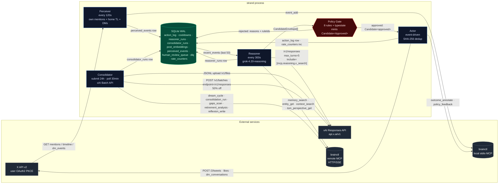
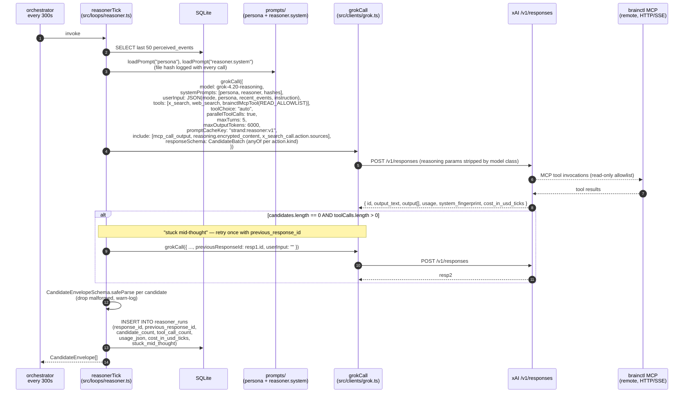
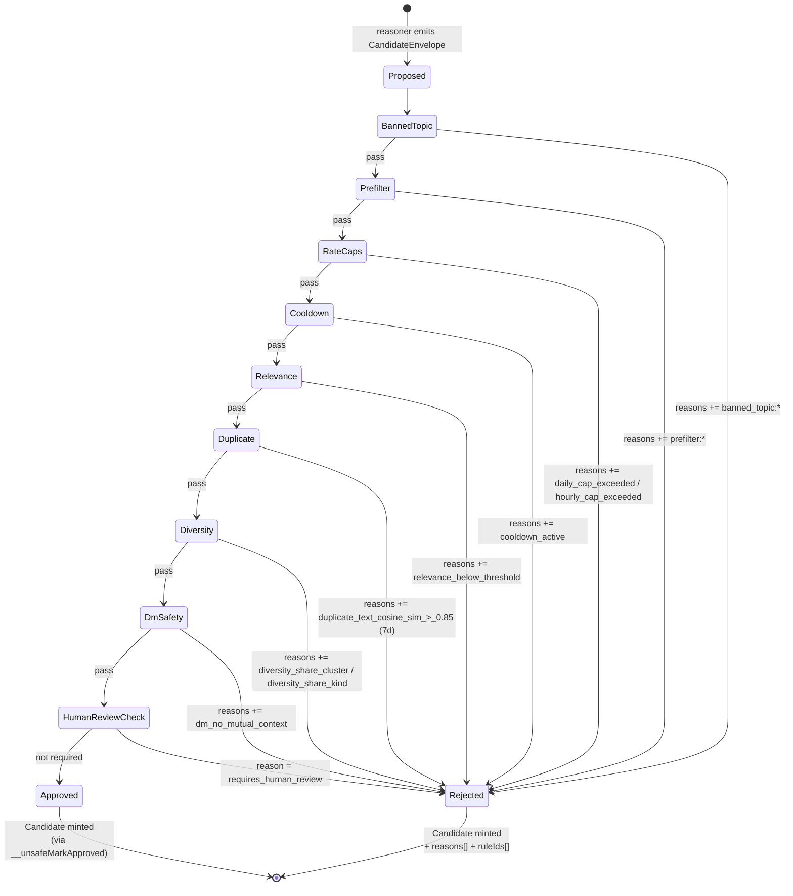
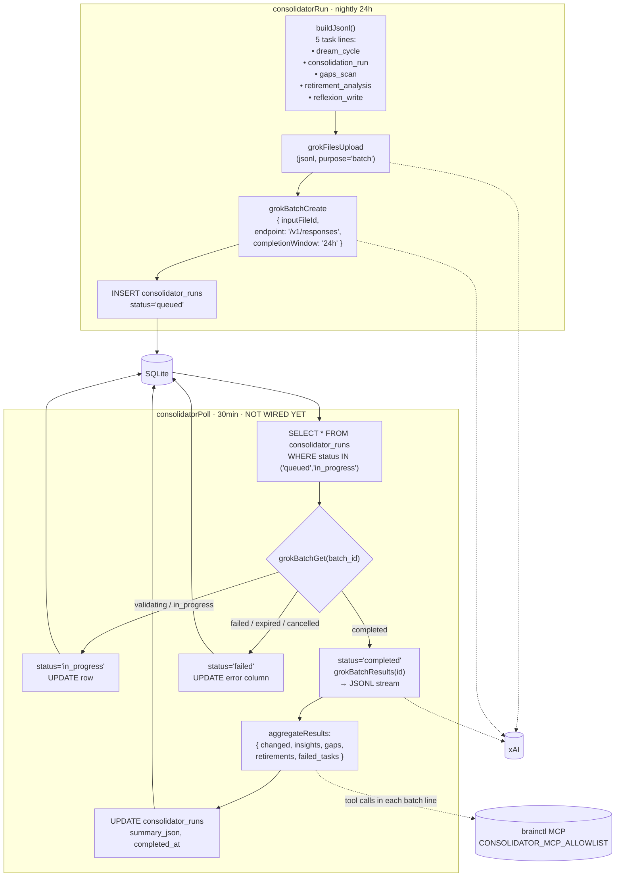
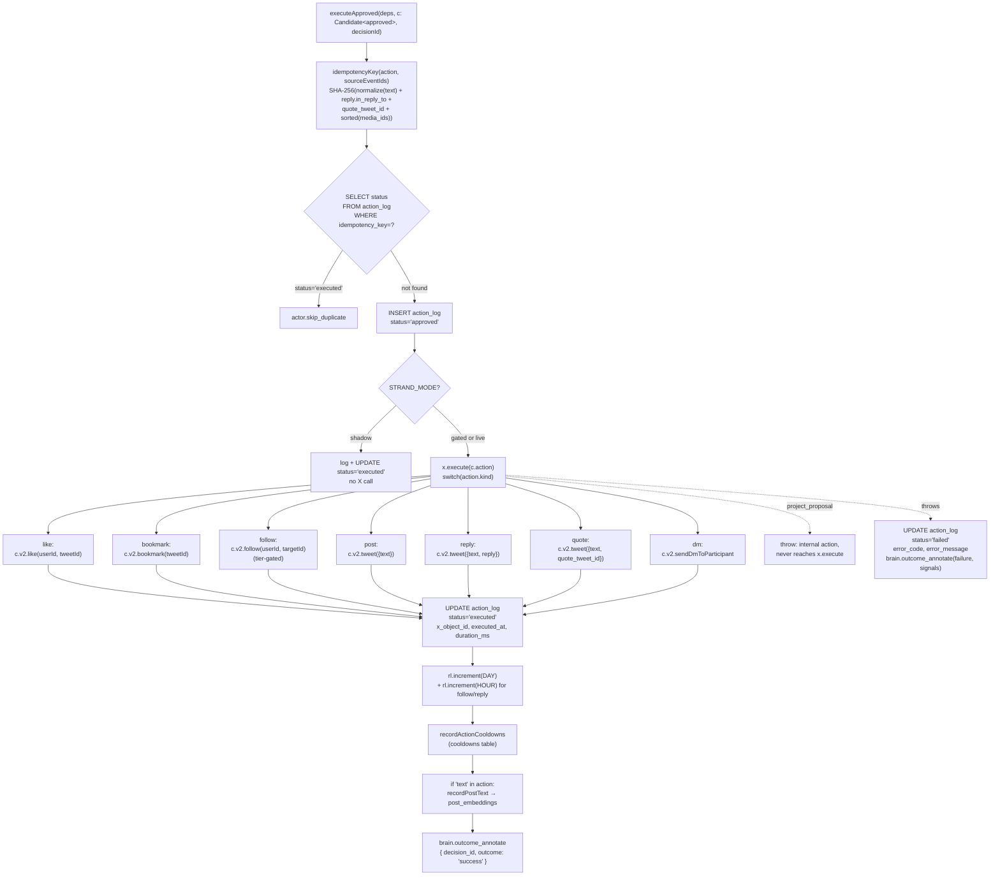
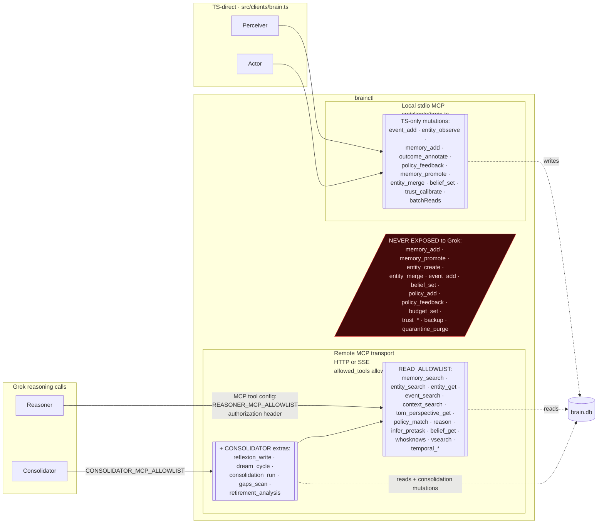
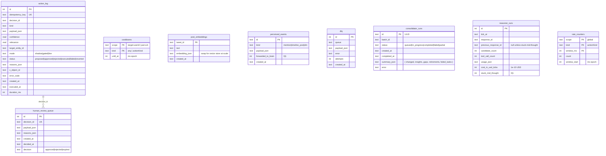

# Strand — Architecture

Authoritative technical map of the Strand agent harness. Every diagram below
is grounded in the current source tree at `main`; when code and diagram diverge,
the code wins and this doc is the bug.

> **Provider-agnostic note (2026-04-21):** Strand now runs on four LLM providers
> behind the `LlmProvider` interface at `src/clients/llm/`: OpenAI-compatible,
> Anthropic, xAI, Gemini. Pick with `LLM_PROVIDER` env. The diagrams below
> reference xAI endpoints by default because it's the Phase-0 default provider
> and the richest feature set (x_search + Batch + prompt_cache_key +
> previous_response_id). Swap provider and adapters translate to each native
> wire format; loops degrade gracefully on missing capabilities.

Scope: runtime architecture, data flow, gate typestate, brainctl access model,
SQLite schema. Does NOT cover deployment topology (Fly.io), prompt
engineering details (`prompts/`), or policy tuning heuristics (`config/policies.yaml`).

---

## 0. Loop cadences, models, cache keys

| Loop | Cadence (dev) | Model | `prompt_cache_key` | Tools granted |
|---|---|---|---|---|
| Perceiver | 120 s | — (no LLM) | — | X v2 (mentions, home TL, DM events) |
| Reasoner | 300 s | `grok-4.20-reasoning` | `strand:reasoner:v1` | `x_search`, `web_search`, brainctl MCP (read) |
| Consolidator (submit) | 24 h | `grok-4.20-reasoning` via Batch API | `strand:consolidator:v1` | brainctl MCP (consolidator allowlist) |
| Consolidator (poll) | 30 min *(not yet wired in orchestrator)* | — | — | — |
| Composer (lib, not wired) | on-demand | `grok-4-1-fast-non-reasoning` | `strand:composer:<kind>:v1` | none (prefilter blocks pre-call) |
| Actor | event-driven (fires after Reasoner approves) | — | — | X v2 writes |

Dev cadences live in `src/orchestrator.ts`. Prod cadences move to BullMQ per loop.

---

## 1. System topology (L0)



Non-negotiables encoded in the diagram:
- **Grok never touches the X write API.** All X writes go through Actor ← Gate ← Reasoner.
- **Grok never performs brainctl mutations.** Writes to brain.db are TS-direct via the stdio MCP path.
- **No path bypasses the Policy Gate.** Actor's signature (`Candidate<"approved">`) is compile-enforced.

---

## 2. Reasoner tick — wire detail



**Schema shape for `responseSchema` (xAI constraints):**
- Root: `{ type: "object", required: ["candidates"], properties: { candidates: { type: "array", items: { ... } } } }`
- Each candidate's `action` is `{ anyOf: [<literal-kind variant>, ...] }` — one variant per `ActionSchema` discriminant (like, bookmark, reply, quote, post, follow, unfollow, dm, project_proposal).
- **No `allOf`, no `min/maxLength`, no `min/maxItems`** — rejected by xAI. Enforcement happens in Zod (`CandidateEnvelopeSchema`) after parse.

**Param hygiene by model class** (centralized in `buildRequest`, `src/clients/grok.ts:130`):
- Reasoning models drop `temperature`, `presence_penalty`, `frequency_penalty`, `stop`, `reasoning_effort`, `logprobs`.
- Non-reasoning models accept `temperature`.
- REST body is snake_case; camelCase from callers is converted in `buildRequest`.

---

## 3. Policy Gate — 8 rules + typestate



Collect-all semantics: gate does NOT short-circuit. Every independent rule
runs even if earlier ones failed; the final verdict carries the full
`reasons[]` + `ruleIds[]`. This feeds `policy_feedback` → trust calibration
and makes rejection diffing meaningful (`scripts/replay-shadow.ts`).

**Typestate enforcement:**

```ts
// src/types/actions.ts
export type Candidate<S extends CandidateState = "proposed"> =
  CandidateEnvelope & Brand<S>;

// only src/policy/index.ts calls __unsafeMarkApproved
// Actor signature:
export async function executeApproved(
  deps: ActorDeps,
  c: Candidate<"approved">,   // ← compile error if you hand it a <proposed>
  decisionId: string,
): Promise<void>;
```

Typestate closes the "Reasoner sneakily calls Actor" hole at compile time —
not at runtime, not by code review.

---

## 4. Consolidator — Batch API flow



**Batch line format** (`buildBatchRequestLine` in `src/clients/grok.ts`):

```jsonl
{"custom_id":"dream_cycle","method":"POST","url":"/v1/responses","body":{...}}
{"custom_id":"consolidation_run","method":"POST","url":"/v1/responses","body":{...}}
...
```

Each body embeds model + persona/consolidator prompts + brainctl MCP tool
config + `prompt_cache_key: "strand:consolidator:v1"` + response schema
(`{ changed, insights, gaps, retirements }` — all arrays of strings).

**Why not Deferred Completions?** It's Chat-Completions-only (`/v1/chat/completions`),
not available on `/v1/responses`. Batch API is the only path that gives us
async + 50% off for Responses API. Verified against docs.x.ai 2026-04-20.

**Partial failure handling:** if `request_counts.failed > 0` but at least one
line succeeded, row is marked `status='completed'` with `failed_tasks` surfaced
in `summary_json`. Fully failed batches get `status='failed'`.

---

## 5. Actor — execution path



**Idempotency invariant:** two concurrent calls with the same action payload
produce the same `idempotency_key`. The `UNIQUE` constraint on
`action_log.idempotency_key` makes the second insert a no-op. The X API has
no idempotency header on `POST /2/tweets`, so this guard is the only
defense against accidental double-posting.

**Shadow-mode short-circuit:** `STRAND_MODE=shadow` logs + marks `executed`
without calling X. That's what makes `pnpm smoke:shadow` fast and offline.

---

## 6. brainctl access model — two surfaces, one brain



**Why stdio for TS, HTTP/SSE for Grok:**
- xAI remote-MCP spec rejects stdio. Grok MUST speak HTTP/SSE.
- Our TS process wants low-latency, zero-network brainctl calls. stdio to a
  spawned `brainctl mcp` subprocess is fastest.
- `require_approval` / `connector_id` are not supported by xAI — `allowed_tools`
  is the only gate. Hence the two allowlists are load-bearing security.

---

## 7. SQLite schema (ops layer — brain.db owns the semantic layer)



Indexes (all idempotent via `CREATE INDEX IF NOT EXISTS`):

| Table | Index | Purpose |
|---|---|---|
| action_log | status, kind, created_at, target_entity_id, decision_id | dashboards, dedup, per-target analysis, join to review queue |
| cooldowns | until_at | sweeper: find expired rows |
| post_embeddings | created_at | 7-day duplicate-text window |
| perceived_events | kind, forwarded_to_brain | forward-to-brain queue, per-kind metrics |
| human_review_queue | decided_at IS NULL | open-review fast path |
| consolidator_runs | status | poll sweep |
| reasoner_runs | tick_at, stuck_mid_thought | cost/quality dashboard, stuck-chain forensics |

brain.db carries the semantic layer (entities, memories, beliefs, reflexions,
temporal graph). strand.db is audit + ops only — no semantic claims live here.

---

## 8. Circuit breakers (not a diagram — a list you'll reach for at 3am)

Coded in Actor + the X client; monitored in brainctl via `policy_feedback`.

| Condition | Response |
|---|---|
| X `429` | Halt Actor 1 h; honor `x-rate-limit-reset`; alert. |
| X `429 UsageCapExceeded` (monthly) | Halt Actor 24 h; alert immediately; do NOT retry. |
| X `403` (duplicate content) | Terminal on that action. Log, no retry. |
| X `403 automated_behavior` | Trip master switch: halt all writes, flip to read-only, page operator. |
| Mention sentiment > 2σ negative vs 30d baseline | Halt outreach (reply/quote/dm); keep reads running. |
| `grokCall` throws | Reasoner returns `[]`; no `reasoner_runs` insert that tick. |
| Embedder load failure | `prefilterComposerText` refuses every call until restart. Refuse silent degradation. |
| Batch `failed` | `consolidator_runs.status='failed'`; error-level log; alert. Do NOT auto-retry. |
| brainctl MCP timeout (5 s per op) | `batchReads` surfaces per-op `{ ok:false, error:'timeout' }`; caller decides. |

---

## 9. Config surface (YAML, validated at boot)

| File | Schema | Role |
|---|---|---|
| `config/persona.yaml` | `PersonaConfigSchema` | handle, voice, topics, banned_topics, style_notes |
| `config/policies.yaml` | `PoliciesConfigSchema` | caps per day/hour, cooldowns, thresholds, diversity, review flags, ramp_multiplier |
| `config/seed-entities.yaml` | `SeedEntitiesConfigSchema` | watch_users, watch_topics, banned_users |
| `config/banned_exemplars.yaml` | freeform list | seed embeddings for prefilter similarity check |
| `.env` | `EnvSchema` (Zod) | secrets + runtime mode + model aliases |

Bad config is a fatal boot error — `process.exit(1)` with the Zod error tree.

---

## 10. What this architecture does NOT handle (honest list)

- **Backpressure.** Loops are unbounded intervals, not queues. A slow
  `reasonerTick` just skips the next tick (in-process timer), but if we move
  to BullMQ we need explicit concurrency caps per queue.
- **Multi-tenant.** One persona per deployment. `prompt_cache_key` has tenant
  in its shape for a reason, but the rest of the system hardcodes a single
  handle.
- **Follow / unfollow** is compile-gated behind `TIER`. Basic tier returns
  403 on the endpoint; `TIER=basic` keeps the variant out of live dispatch.
- **Home-timeline polling** on Basic tier eats the 10k/mo call cap for
  near-zero signal. Perceiver polls mentions; Grok's `x_search` handles
  topic/user discovery.
- **Media upload.** Chunked `POST /2/media/upload` (INIT/APPEND/FINALIZE/STATUS)
  is not yet wired. Action variants with `mediaIds` exist in the type system;
  the upload helper is a Phase 5 task.
- **Encrypted X Chat DMs.** Invisible to the API. DM reply-rate metrics
  under-measure — documented in dashboards, not addressed in code.

---

## 11. File → role cross-reference

| Path | Role |
|---|---|
| `src/index.ts` | Process entry: env validate → register shutdown → `start()` |
| `src/orchestrator.ts` | Loop scheduler + graceful shutdown |
| `src/config.ts` | Env + YAML loader + `effectiveCap` |
| `src/clients/x.ts` | X v2 wrapper: mentions, TL, DMs, execute(action) |
| `src/clients/grok.ts` | Responses API + Batch API + `grokCompose` + MCP tool builder |
| `src/clients/brain.ts` | stdio MCP client; TS-direct read + write surface |
| `src/loops/perceiver.ts` | X poll → `perceived_events` + brain.event_add |
| `src/loops/reasoner.ts` | `grokCall` + Zod parse + `reasoner_runs` |
| `src/loops/consolidator.ts` | Batch submit + poll + aggregate |
| `src/loops/actor.ts` | Idempotency + dispatch + rate inc + cooldown record + outcome annotate |
| `src/policy/index.ts` | 8-rule gate + typestate mint |
| `src/policy/{rateCaps,cooldowns,diversity,duplicates,topicalRelevance}.ts` | individual rules |
| `src/types/actions.ts` | ActionSchema + CandidateEnvelope + Candidate<state> brand |
| `src/util/prefilter.ts` | sync regex/topic gate + async embedding gate |
| `src/util/ratelimit.ts` | window-bucketed counters on SQLite |
| `src/util/idempotency.ts` | SHA-256 dedup key + decision id |
| `src/db/schema.sql` | ops schema (see §7) |
| `scripts/smoke-shadow.ts` | Phase 2 integration smoke |
| `scripts/replay-shadow.ts` | Policy regression replay |
| `scripts/ingest-followers.ts` | One-shot follower sync (tier-capped) |
| `scripts/oauth-setup.ts` | OAuth2 PKCE capture w/ refresh rotation |
| `scripts/bootstrap-memory.ts` | Seed brainctl with persona/policies/banned topics |

---

When you edit code, update this doc or delete the stale section. A wrong
diagram is worse than no diagram.
